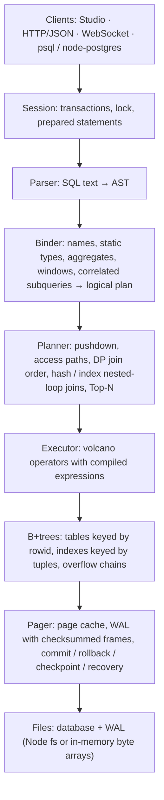

# OpusDB

A relational SQL database written from scratch in TypeScript by Claude Opus 5.5, as one entry in this
model-comparison playground. It has a page-based storage engine with a write-ahead log, a cost-based SQL
engine, a network server that speaks the PostgreSQL wire protocol, and a browser Studio for looking inside
all of it.

> **Özet (TR):** OpusDB, sıfırdan TypeScript ile yazılmış ilişkisel bir SQL veritabanıdır. B+tree tabanlı
> sayfa depolama, WAL ile çökme kurtarma, maliyet tabanlı sorgu planlayıcı, PostgreSQL protokolü (gerçek
> `psql` ile bağlanılabilir) ve tarayıcıda çalışan görsel bir Studio içerir. 70.650 rastgele sorguda
> SQLite ile %100 aynı sonucu verdi ve bu süreçte SQLite 3.51.2'de iki hata buldu. Ayrıntılı öz rapor
> için [BENCHMARK.md](BENCHMARK.md) dosyasına bakın.

- **Live Studio:** https://claude.ai/artifact/M6GqoZULfdHVtRJ3RegaSj (the whole engine runs in the page;
  the link is private to the repository owner until shared)
- **Self-report and numbers:** [BENCHMARK.md](BENCHMARK.md)
- **SQLite bugs found by the fuzzer:** [docs/sqlite-bugs.md](docs/sqlite-bugs.md)

## Quick start

Node.js 22.18+ runs the TypeScript sources directly, so the engine and server need no build step.

```bash
cd opus-5.5
npm install
npm test                        # engine + server test suites (B+tree, SQL, crash, fuzz, protocols)
npm run fuzz -- --seeds 50      # differential fuzzing against SQLite
npm run bench                   # OpusDB vs SQLite (add --file for on-disk)
npm run build                   # build the Studio (dist/ + a single-file page)
npm run server -- --demo        # HTTP + Studio on :8080, PostgreSQL protocol on :5433
psql -h 127.0.0.1 -p 5433       # any Postgres client works
```

Using the engine as a library:

```ts
import { Database } from '@opusdb/engine';          // in-memory, works in browsers too
import { openFile } from '@opusdb/engine/node';     // file-backed: app.opusdb + app.opusdb-wal

const db = openFile('app.opusdb');
db.exec(`CREATE TABLE users (id INTEGER PRIMARY KEY, name TEXT NOT NULL, city TEXT)`);
db.query('INSERT INTO users (name, city) VALUES (?, ?)', ['Ada', 'London']);
const top = db.prepare('SELECT city, count(*) AS n FROM users GROUP BY city ORDER BY n DESC');
console.log(top.objects());
console.log(db.query('EXPLAIN ANALYZE SELECT * FROM users WHERE id = 1').rows.map((r) => r[0]).join('\n'));
db.close();
```

## Layout

```
opus-5.5/
├─ packages/engine     the database (no runtime dependencies)
│  ├─ src/sql          lexer, parser, AST, printer
│  ├─ src/plan         binder (names, types, aggregates, windows), planner/optimizer
│  ├─ src/exec         volcano operators, expression compiler, functions, DML, constraints
│  ├─ src/storage      record codec, page formats, pager + WAL, B+tree, files
│  ├─ test             B+tree model tests, SQL tests, SIGKILL crash test, differential fuzzer
│  └─ bench            OpusDB vs SQLite benchmark
├─ packages/server     HTTP/JSON API, WebSocket sessions (RFC 6455 from scratch), PostgreSQL protocol
├─ packages/studio     React + Vite Studio (query editor, plans, B+tree lab, storage, benchmarks)
└─ docs                benchmark and fuzzing results, SQLite bug reports
```

## Architecture



**Storage.** Every page is 4 KiB. Table B+trees are keyed by rowid (an `INTEGER PRIMARY KEY` aliases it)
and store encoded rows, spilling large rows into overflow chains; index B+trees store tuples of the indexed
columns plus the rowid. Nodes split on a byte budget, merge or redistribute below a quarter full, and use
an append fast path that packs sequential inserts completely full. The schema lives in its own B+tree.

**Transactions.** Dirty pages stay in the cache until commit (no-steal), so rollback is just dropping them.
A commit appends each dirty page to the WAL as a frame; frames are chained with a cumulative checksum and
the last one carries a commit marker. On open, the WAL is replayed up to the last valid commit, so a torn
write is ignored. A checkpoint copies the newest frames into the main file. Statement-level rollback uses
before-images of the pages the statement touched. Transactions are serialised with a database-wide lock.

**Queries.** The binder gives every column a global id so the optimizer can reorder joins freely. The
planner pushes predicates through projections, aggregates, set operations and joins, picks rowid, index
or index-only access paths by cost, orders inner-join clusters by dynamic programming over subsets, and
chooses hash, index nested-loop or nested-loop joins per step. `ORDER BY` can be satisfied by index order,
and `ORDER BY … LIMIT` becomes a bounded heap. Expressions compile to JavaScript closures.

**Semantics.** Statically typed like PostgreSQL, but with SQLite's runtime rules where they differ (NULLs
sort first, integer division, type affinity in comparisons, ASCII case-insensitive `LIKE`), which is what
makes result-for-result comparison against SQLite possible.

## SQL supported

`SELECT` with joins (inner, left, right, full, cross, natural, `USING`), subqueries (scalar, `IN`,
`EXISTS`, correlated, derived tables), `GROUP BY`/`HAVING`, aggregates with `DISTINCT`, `FILTER` and
`ORDER BY`, window functions (`row_number`, `rank`, `dense_rank`, `ntile`, `lag`, `lead`, `first_value`,
frames with `ROWS`/`RANGE`), `WITH` and `WITH RECURSIVE`, `UNION`/`INTERSECT`/`EXCEPT`, `VALUES`,
`generate_series`, `LIMIT`/`OFFSET`/`FETCH FIRST`; `INSERT … SELECT`, `INSERT OR REPLACE/IGNORE`,
`ON CONFLICT DO NOTHING/UPDATE` (upsert), `UPDATE … FROM`, `RETURNING`; `CREATE/DROP TABLE|INDEX|VIEW`,
`CREATE TABLE AS`, `ALTER TABLE ADD COLUMN / RENAME`; `NOT NULL`, `UNIQUE`, `PRIMARY KEY`, `CHECK`,
`DEFAULT`; `BEGIN/COMMIT/ROLLBACK`, `EXPLAIN [ANALYZE]`, `ANALYZE`, `CHECKPOINT`; parameters `?`, `?N`,
`$N`, `:name`; about 80 scalar functions including SQLite's date/time functions and `printf`.

## Limits

Foreign keys are parsed but not enforced. One writer or explicit transaction runs at a time; readers wait
for it (no MVCC). `AUTOINCREMENT` behaves like a plain rowid. Index keys are limited to about a quarter of
a page. There is no `VACUUM` compaction yet (free pages are reused instead).
